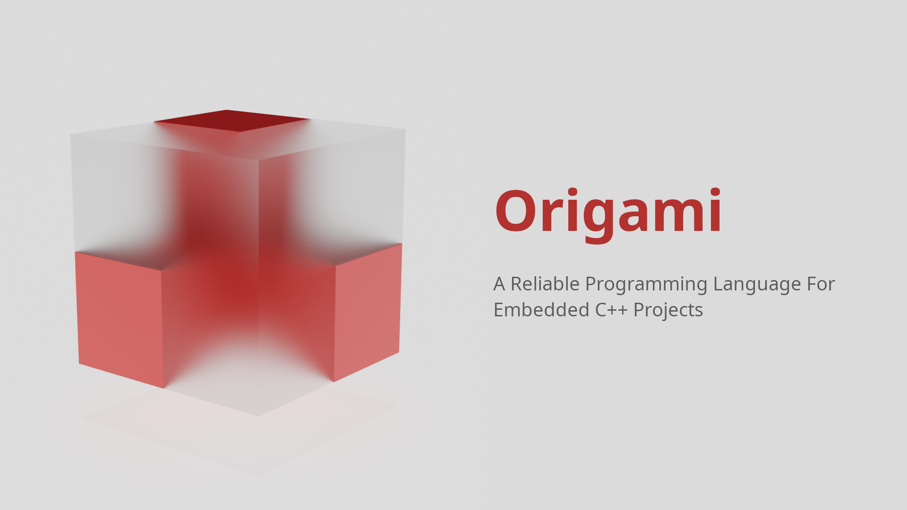

# Origami

**Origami** is an open source hyper flexible and moding friendly programming language made for C++ Program who really want a very reliable and super simple language for their projects.



**Origami** is heavily focused on it's simplicity , Both in the programming language and it's API, The language itself is a backend driven language means that the **Origami** only have the core features including, Variables, Conditional and loops , The functions are defined by the backend programmer directly for using in program.

## Advantages of Origami

- Easy to use
  
- Easy to embed
  
- Super Simple API
  
- Very reliable in complex setups too
  
- Fast enough to do basic tasks
  

## What Origami is Not ?

**Origami** is not made to replace things like python, **Origami** was mainly made to serve as a proper minimal scripting language for C++ projects without being general purpose.

## Tutorial For Origami Language

This tutorial will cover the entire **Origami Language** very well, It's requested from you to pay attention here.

### Comments In Origami

**Origami** also supports comments, Which are basically ignored by the `Lexer` during the *tokenization* process. They can be used to document something.

Anything starts with a `#` becomes a comment.

```ruby
# This is a comment
```

### Variables in Origami

Just like other languages **Origami** supports variables too, And they can be creates like `name` `=` `value`. The value can be either `string` or a `number`.

#### Example:

```ruby
a = 12
b = "Hello"
```

Here `a` is a number and `b` is a string.

### Arithematic Operations in Origami

**Origami** have first class support for all the commonly used arithematic operations on variables and their values.

Here is a list of operations we can perform

```ruby
a = 12
b = 2

# Operations
c = a + b # Add a and b
d = a - b # Subtract a and b
e = a * b # Multiply a and b
f = a / n # Divide a and b
g = a % b # Divide to get the remainder of a and b
```

### Boolean Operations In Origami

**Origami** supports the boolean operations too. A Boolean operations allows us to get `True` or `False` (`0`or`1`) depending on the input.

For example we might want to check if `1` is greater than `2` then we can perform a boolean operation to check if it's `true` ot not. If it's `true` then operation will become `1` otherwise `0`.

**Origami** supports all the standard boolean operations too

```ruby
a = 1 > 2 # False
b = 1 < 2 # True
c = 1 = 1 # True
```

> A quick note though: The `=` operator have 2 different meanings, Before assignment it works a an assignment operator but after assignment it works as a comparison operator

### Logical AND | OR | NOT Operators in Origami

**Origami** have the first class support for the *Logical &*, *Logical |* and *Logical !* Operators.

- **Logical &**: This operator returns true if both, The left and the right sides returns `True`(`1`).
  
- **Logical |**: This operator returns true if either, The left or the right sides returns `True`(`1`).
  
- **Logical !**: This operator flips the values, Turning `True` into `False` and vice-versa.
  

#### **How to use ?**

Well **Origami** allows you to directly use these operators in **variables** and **expressions**

```ruby
a = 1 & 1 # True
b = 1 & 0 # False
c = 1 | 1 # True
d = 1 | 0 # False
e = !1 # False
f = !0 # True
```

> A quick note though: **Origami** do supports these operators but **origami** do not supports `()` and operator presidence, **Origami** is completely left - right evaluation language, To reduce the execution time and complexity of both the **runtime** and the scripts written with **origami**. Please note that this is a delibrate choice not a bug.

### If - else statements in Origami

**Origami** supports the `if-else` statements for heavy logic, Combined with the `Operators`. **Origami** becomes a fairly simple scripting language to work with.

We can easily create `if-else` blocks like this.

```ruby
if condition {
    # Body goes here
}{
    # Else body goes here
}
```

The `if` block runs if the entire `condition` becomes `True` (1) , `else` (`{}` after the `if` block) runs if the entire `condition` becomes `False` (0).

#### Example:

```ruby
a = 1
b = 2
c = a + b
d = "Message"

if c = 3{
    d = "c is equals to 3"
}{
    d = "c is not equals to 3"
}
```

See how easy it was to use if else to make logic ?

We can even make `else if` like this

```ruby
a = 1
b = 2
c = a + b
d = "Message"

if c = 4{
    d = "c is equals to 4"
}{
    if c = 3{
        d = "c is equals to 3"
    }
    {
        d = "c is not equals to 3"
    }
    d = "c is not equals to 4"
}
```

> A quick note: You can even use complex chains in if else statements if you want

### Loops in Origami

**Origami** have 2 main loops , The `while` loop and The `times` loop

- **while**: The `while` loop takes a `condition` and runs until the `condition` becomes `False` (0).
  
- **times**: The `times` loop takes an `array` of `arguments` and returns every `argument` one by one, Per `iteration` (An complete cycle of a loop is called it's `iteration`).
  

#### **Syntax**

###### **while**

```ruby
while condition{
    # Body
}
```

**Example**:

```ruby
i = 0
while !i = 10{
    i = i + 1
}
```

This will run 10 times.

###### **times**

```ruby
times x list{
    # body
}
```

**Example**:

```ruby
d = ""
times x "Hello", "world", "2026!"{
    d = d + x
}
```

This will make d `Helloworld2026!`

> A quick yet important note: **Origami** do not have a builtin `break` or `continue` statement like other languages, So use loops `efficiently` in programs. This is because **Origami** is not a **General Purpose Programming Language**, It's made to be **Embedded** into C++ Projects.

### Functions in Origami

**Origami** functions are extremely powerful because they are directly written in **C++** not in the **Origami** itself, Which means that the programer can actually terminate the loops and do anything they wants inside the program directly from the **C++** code.

While **Origami Functions** are written in **C++** they are fairly easier to write and use too.

We will look at creation of **Origami Functions** when we will look at the **Origami's C++ API** later in this **README** but as of now we will focus on learning how to call those functions.

To call an **Origami Function** we will need to write it's name and then two `()` brackets , Inside which we can pass $`n`$ number of arguments of different types (`Numbers` and `Strings`)

**Example**

```ruby
a = 1
b = 2
c = add(a, b)
```

This will work if we suppose that `add()` function was created already.

**Another Beautiful Example**

```ruby
i = 0
while !i = 10{
    print ("The value of i is ", i)
}
```

This will work too if we suppose that `print()` function was created already.

#### Subfunctions in Origami

**Origami** also have **sub functions** which are actually present to make the **Origami** codebases much more redable by allowing the **Functions** to be "Chained" together.

**Example**

```ruby
myfunction()
    .mySubFunction()
    .myOtherSubFunction()
    .mySubFunction()
    .mySubFunctionWithArgs(1,2,3)
```

These are converted to:

```ruby
myfunction_SUBFUNC_mySubFunction()
myfunction_SUBFUNC_myOtherSubFunction()
myfunction_SUBFUNC_mySubFunction()
myfunction_SUBFUNC_mySubFunctionWithArgs(1,2,3)
```

During the preprocessing stage of the execution.

If the main funtion had arguments like.

```ruby
myfunction(1,2,4)
    .mySubFunction()
    .myOtherSubFunction()
    .mySubFunction()
    .mySubFunctionWithArgs(1,2,3)
```

Then the main function will be called too but after the subfunctions like this.

```ruby
myfunction_SUBFUNC_mySubFunction()
myfunction_SUBFUNC_myOtherSubFunction()
myfunction_SUBFUNC_mySubFunction()
myfunction_SUBFUNC_mySubFunctionWithArgs(1,2,3)
myfunction(1,2,4)
```

Even though the subfunction order will be maintained.

> A quick note though: You can deeply nest any number of functions or subfunctions without facing any issues. Origami allows that

---

## C++ API Of Origami Language

**Origami** exposes a very straight forward and a very advanced **C++ API** via it's libraries.

Let's start with the **Simple API** or **User Facing API**

### Simple API

To access this **API** make sure to include the **library/origami.hh** headerfile in your project before you write anything.

The **Simple API** provides us two **classes** to work with inside the `origami::` namespace.

- **ProgramFile**: This class takes the file path to an origami script and allows you to directly run it.
  
- **Program**: This class takes the raw origami program and lets you run that directly.
  

The **SimpleAPI** exposes 2 main things:

- **runtime** (Object): The object to the **Runtime** class which we can use to directly create new **Origami Functions** and manipulate the **Runtime** directly (The execution srate of a programming language is called it's **Runtime**)
  
- **run** (Function): The function we uses to **execute**/**run** the origami programs.
  

**Example**:

```cpp
#include "library/origami.hh"

int main(){
    origami::ProgramFile file("myprogram.origami");
    file.run();    
}
```

or

```cpp
#include "library/origami.hh"

int main(){
    origami::Program program(R"(
a = 1
b = 2
c = a + b
)");
    program.run();    
}
```

Yes that is liteally everything you get in the **Simple API**

> A quick note for those who don't know `R"()"` in C++. It's basically a way to write multilinear strings in `C++` without a lot of `hassel` In case you don't want to use them then just use normal `std::string` with `Program` nothing is wrong in that.

### Advanced API

This is the direct `API` Provided by the `Runtime` of the **Origami Language**. You can directly manage the execution stage here.

This `API` Allows you to bypass the `SimpleAPI` entitely if you do not want it , Or you want full control over the execution stage of the program. This API Also allows you to create the function in **Origami** via **C++** directly.

Everything in `AdvancedAPI` exists under the `origami::oint::` namespace (`oint` just means `Origami Interpreter` because `AdvancedAPI` is the direct `Interpreter's API` we can use to even mod `Origami`)

#### Lexer Function

The `AdvancedAPI` Provides us the `Lexer` function to convert the **raw origami code** into usable **Tokens** that the **Runtime Class** can later use to execute the programs.

> A cute note for advanced programmers: `Tokens` are nothing more than `std::vector <std::string> tokens` .

#### Runtime class

The `AdvancedAPI` Provides us the `Runtime` class which we can use to control the execution stage of the **Origami** programs.

**Runtime** class provides us:

- **execute(tokens)**: This function takes the tokens (`std::vector <std::string>` Feel free to ignore this entirely if you feels uncomfortable), It takes the tokens from the `Lexer` to run the code.
  
- **make_normal(variable, type)**: This function can return ready to use strings if you get `raw tokens` from the `execute` or in a `function`. For example if you believes that a variable stores a number than you can call this function with the variable string value and pass `ORIGAMI_ARGUMENT` or any number in it's second argument, It will return the number if it's a number or will return `0`.
  
- **normalize_expression(tokens, lines)**: This function can take `Lexer` tokens to call the `functions` and replace the `variables` with their `values` and return new `Tokens` to work with.
  
- **make_function(name, function)**: This **function** lets us create those **functions** which the **Origami Program** can use during it's execution stage.
  
- **sub_function(fname, name)**: This **function** takes a **function name** and a **subfunction name** and returns a `std::string` with format `fname_SUBFUNC_name`, Use this with `make_function` to create usable `subfunctions`.
  

#### Creating custom functions in Origami

Now as you are familiar with the `API` Origami provides, Let's get focused on writing our own functions for `Origami` programs to use

To make **Origami Functions** you must understand that **Origami** uses the classic *C-Style-Functions* means that the arguments the **Function** can take are fixed. The return type is fixed too. In order to overcome this issue, As `Origami` scripts can have $n$ numbers of **arguments** for the **functions**, And the **functions** can also return $n$ numbers of arguments.

**Origami** uses the `std::vector` of `std::string` type, Please watch a tutorial on `std::vector` and `std::string` otherwise `Origami` may feel confusing to you.

So with that's in mind, **Origami** functions are required to return a `std::vector <std::string>` and take one argument of that type, The return value can let the `Origami` interpreter return soo many values at once in an `array` and a single argument of `std::vector <std::string>` can store all the $n$ numbers of arguments without any issues. So the **Function** becomes.

```cpp
std::vector <std::string> my_function (std::vector <std::string> args){
    return {"Hello", "World", "2026", "!"};
}
```

Do not worry for the types, The **Origami's Interpreter** will automatically detect the correct types for the values.

Now there is a problem, We have created out function but the **Origami's Interpreter** do not know what our function is. So we can tell it via the **Runtime Class's make_function** method.

**Example**

```cpp
myfile.runtime.make_function("my_function", my_function);
```

Feel free to give any name to your string value, Just remember that the function will be named that exact thing in the *Origami Programs*

## Let's do a simple example!

Our origami file is `a.origami` and source code is `main.cpp`

### a.origami

```ruby
i = 1
while !i = 100{
    x = i % 2
    if x = 0{
         print ("i is av even number: ", i)
    }
    i = i + 1
}
```

### main.cpp

```cpp
#include "../library/origami.hh"
#include <iostream>

origami::function print(origami::function args){
    for (std::string s: args){
        std::cout << s << '\n';
    }
    return {};
}

int main(){
    origami::ProgramFile file("a.origami");
    file.runtime.make_function("print", print);
    file.run();
}
```

> This was all the API of the origami language, Please note that before reporting any bugs to origami take a look at your code , Maybe your own code might be causing bugs.

### A very important case
**Origami** do not have the operator presidence but it still have operator evaluation.
Let's suppose that you have `1 + 1 - 2` Now the output should be `1 + 1` which is `2` then `2 - 2` which is `0` but no. The output will be `0` but now like how you think. **Origami** will resolve both the left and right operands before performing addition. Means `1-2` and `1` will be performed before anything. 

Now `1 - 2` is `-1` and `1` is just `1` so we get `1-1` which is `0`. This is why it matters.

Why do you need to know this ?
If you ignore this then you will fall into classic **Faliure by zero divison**.

**Look at this carefully**
```ruby
i = 1
while !i = 100{
    if i % 2 = 0{
         print ("i is av even number: ", i)
    }
    i = i + 1
}
```

Found anything wrong ?
Well it's simple , Look at the `if` statement.
It says `i % 2 = 0` Now this is the problem because, When ever the **Origami** will find `%` operator it will try to normalize both left and right operands before it can divide them. So here `i` will become `1` as it's previous value was `1` but `2 = 0` will compare if `2` is `0` via the **Boolean Operator** and this is `False` means `2 = 0` will become `0` and **Origami** will get `1 % 0` which is the `Divide by Zero Error`.

So before reporting these please try to check your programs to see if they are logically fine.

The correct version of that program will be
```ruby
i = 1
while !i = 100{
    x = i % 2
    if x = 0{
         print ("i is av even number: ", i)
    }
    i = i + 1
}
```

Because x will already be calculated even before the comparison.
---

## License

**Licensed** under the **MIT License** (No credits are required)

## Contributions

**Contributions** are welcome, But please follow the `CONTRIBUTING.md` for higher chance of getting accepted.

## Installation

**Installation** is very straightforward, Just clone this repository and the entire **Origami Library** is under the `library` directory. Just make sure to build the objects via `library/build.sh` file and combine them during the compilation.

## Bug reporting

Please report any bugs by opening the an `issue`.

## Thanks you for reading!
